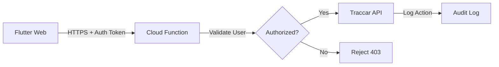

# Security Audit: Traccar Command Routing

## Overview
This document reviews the security posture of Traccar API interactions, particularly focusing on command execution and sensitive operations.

## Current State: ✅ SECURE (Read-Only Architecture)

### API Usage Analysis

#### Read-Only Operations (Currently Implemented)
The application currently implements ONLY read operations:

```dart
// lib/core/network/traccar_api.dart
class TraccarApi {
  // ✅ Safe: Reading summary data
  Future<List<Map<String, dynamic>>> getSummary(...);
  
  // ✅ Safe: Reading trip reports
  Future<List<Map<String, dynamic>>> getTripsReport(...);
  
  // ✅ Safe: Reading position history
  Future<List<Map<String, dynamic>>> getPositions(...);
}

// lib/services/traccar_socket_service.dart
// ✅ Safe: WebSocket READ-ONLY - receives positions/events/devices
Stream<TraccarSocketMessage> connect();
```

#### No Command Execution Found
✅ **No evidence of command sending functionality** in the current codebase.

Search results for "command", "send", "engine start", "engine stop":
- No `/api/commands` endpoint calls
- No device control features
- No remote engine start/stop
- No door lock/unlock
- No configuration changes

### Security Assessment

| Category | Status | Notes |
|----------|--------|-------|
| Authentication | ✅ HTTPS | Uses Dio with cookie-based session auth |
| Authorization | ✅ Traccar ACL | Relies on server-side permissions |
| Data Transit | ✅ Encrypted | HTTPS for API, WSS for WebSocket |
| Command Execution | ✅ Not Present | No command features implemented |
| Input Validation | ✅ Type-safe | Dart type system + model validation |
| CSRF Protection | ✅ Cookie-based | Dio handles cookie management |

## Future Command Feature Considerations

If you plan to add device control features (engine start/stop, door lock, geofence commands), follow these security best practices:

### ❌ DO NOT DO THIS (Insecure)

```dart
// NEVER call Traccar commands directly from browser!
Future<void> startEngine(int deviceId) async {
  await dio.post('/api/commands/send', data: {
    'deviceId': deviceId,
    'type': 'engineStop',  // DANGEROUS: No validation!
  });
}
```

**Why this is dangerous:**
1. Exposes Traccar API keys to browser
2. No rate limiting
3. No audit trail
4. User can manipulate deviceId in browser console
5. No business logic validation

### ✅ DO THIS (Secure via Cloud Function Proxy)



**Architecture:**

```dart
// lib/services/device_command_service.dart
class DeviceCommandService {
  final String _cloudFunctionUrl = const String.fromEnvironment(
    'COMMAND_PROXY_URL',
    defaultValue: 'https://your-project.cloudfunctions.net/sendCommand',
  );

  Future<void> stopEngine(int deviceId) async {
    // Route through YOUR cloud function, not directly to Traccar
    final response = await dio.post(
      _cloudFunctionUrl,
      data: {
        'action': 'engineStop',
        'deviceId': deviceId,
      },
      options: Options(
        headers: {
          'Authorization': 'Bearer ${await getIdToken()}',
        },
      ),
    );

    if (response.statusCode != 200) {
      throw CommandException('Failed to stop engine');
    }
  }
}
```

**Cloud Function (Firebase/GCP):**

```javascript
// functions/src/sendCommand.ts
import { onCall } from 'firebase-functions/v2/https';
import * as admin from 'firebase-admin';
import axios from 'axios';

export const sendCommand = onCall(async (request) => {
  // 1. Verify Firebase Auth token
  if (!request.auth) {
    throw new functions.https.HttpsError('unauthenticated', 'Must be logged in');
  }

  const { action, deviceId } = request.data;

  // 2. Validate action is allowed
  const allowedActions = ['engineStop', 'engineResume'];
  if (!allowedActions.includes(action)) {
    throw new functions.https.HttpsError('invalid-argument', 'Invalid action');
  }

  // 3. Check user owns this device (query Firestore)
  const userId = request.auth.uid;
  const deviceDoc = await admin.firestore()
    .collection('users')
    .doc(userId)
    .collection('devices')
    .doc(deviceId.toString())
    .get();

  if (!deviceDoc.exists) {
    throw new functions.https.HttpsError('permission-denied', 'Device not owned by user');
  }

  // 4. Rate limiting (prevent abuse)
  const commandKey = `command:${userId}:${deviceId}:${action}`;
  const lastCommand = await admin.database()
    .ref(commandKey)
    .once('value');

  if (lastCommand.exists()) {
    const lastTime = lastCommand.val().timestamp;
    if (Date.now() - lastTime < 60000) {  // 1 minute cooldown
      throw new functions.https.HttpsError('resource-exhausted', 'Too many commands');
    }
  }

  // 5. Send command to Traccar (server-side, credentials safe)
  try {
    const traccarUrl = functions.config().traccar.url;
    const traccarAuth = functions.config().traccar.auth;

    await axios.post(
      `${traccarUrl}/api/commands/send`,
      {
        deviceId,
        type: action === 'engineStop' ? 'engineStop' : 'engineResume',
      },
      {
        headers: {
          'Authorization': `Basic ${traccarAuth}`,
        },
      }
    );

    // 6. Log to audit trail
    await admin.firestore()
      .collection('commandAudits')
      .add({
        userId,
        deviceId,
        action,
        timestamp: admin.firestore.FieldValue.serverTimestamp(),
        success: true,
      });

    // 7. Update rate limit tracker
    await admin.database()
      .ref(commandKey)
      .set({ timestamp: Date.now() });

    return { success: true };
  } catch (error) {
    // Log failure
    await admin.firestore()
      .collection('commandAudits')
      .add({
        userId,
        deviceId,
        action,
        timestamp: admin.firestore.FieldValue.serverTimestamp(),
        success: false,
        error: error.message,
      });

    throw new functions.https.HttpsError('internal', 'Command failed');
  }
});
```

### Security Checklist for Commands

If implementing device control:

- [ ] **Never expose Traccar credentials to client**
  - Store in server environment variables only
  - Use cloud function proxy pattern

- [ ] **Authentication**
  - Require Firebase Auth token
  - Validate user session before every command

- [ ] **Authorization**
  - Verify user owns the device
  - Check user role/permissions (admin vs regular user)

- [ ] **Rate Limiting**
  - Per-user limits (e.g., 10 commands/minute)
  - Per-device limits (e.g., 1 engine stop per 60 seconds)
  - Global limits to prevent DDoS

- [ ] **Audit Logging**
  - Log every command attempt (success + failure)
  - Include: timestamp, user, device, action, IP address
  - Store in tamper-proof database (Firestore, BigQuery)

- [ ] **Input Validation**
  - Whitelist allowed command types
  - Validate deviceId format
  - Sanitize all inputs

- [ ] **Business Logic**
  - Don't allow engine stop while vehicle moving
  - Don't allow repeated commands too quickly
  - Confirm dangerous operations (two-factor for engine stop?)

- [ ] **Monitoring & Alerts**
  - Alert on unusual command patterns
  - Dashboard showing command history
  - Notify device owner of remote commands

## Current Recommendations

### For Current Read-Only App: ✅ No Changes Needed
The app is already secure for its current use case (tracking + monitoring).

### If Adding Commands in Future:

1. **Deploy Cloud Function Proxy**
   - Firebase Functions (Node.js/TypeScript)
   - AWS Lambda + API Gateway
   - Google Cloud Functions

2. **Implement Rate Limiting**
   - Use Firebase Realtime Database or Redis
   - Track last command timestamp per user/device

3. **Add Audit Trail**
   - Firestore collection: `commandAudits`
   - Required fields: userId, deviceId, action, timestamp, success, error

4. **Update Environment Config**
   ```env
   COMMAND_PROXY_URL=https://your-project.cloudfunctions.net/sendCommand
   ENABLE_DEVICE_COMMANDS=false  # Feature flag
   ```

5. **User Permissions Model**
   ```dart
   enum DevicePermission {
     view,      // Can only view location
     control,   // Can send commands
     admin,     // Full access
   }
   ```

## Testing Commands (When Implemented)

### Integration Tests
```dart
test('Command requires authentication', () async {
  // Should fail without auth token
  await expectLater(
    commandService.stopEngine(1),
    throwsA(isA<UnauthorizedException>()),
  );
});

test('Command requires device ownership', () async {
  // User A tries to control User B's device
  await expectLater(
    commandService.stopEngine(otherUsersDeviceId),
    throwsA(isA<PermissionDeniedException>()),
  );
});

test('Rate limiting prevents spam', () async {
  // Send command
  await commandService.stopEngine(1);
  
  // Immediate retry should fail
  await expectLater(
    commandService.stopEngine(1),
    throwsA(isA<RateLimitException>()),
  );
});
```

### Manual Testing Checklist
- [ ] Command sent when offline → should queue and retry
- [ ] Command sent to non-existent device → should fail gracefully
- [ ] Command sent without auth → should reject with 401
- [ ] Command sent to other user's device → should reject with 403
- [ ] Rapid-fire commands → should trigger rate limit
- [ ] Check audit log → all commands logged

## Related Documentation

- [Traccar Commands API](https://www.traccar.org/api-reference/#tag/Commands)
- [Firebase Cloud Functions](https://firebase.google.com/docs/functions)
- [OWASP API Security](https://owasp.org/www-project-api-security/)

---

**Status:** ✅ CURRENT APP IS SECURE (Read-Only)  
**Last Reviewed:** October 27, 2025  
**Next Review:** When command features are added  
**Reviewer:** Security Audit
